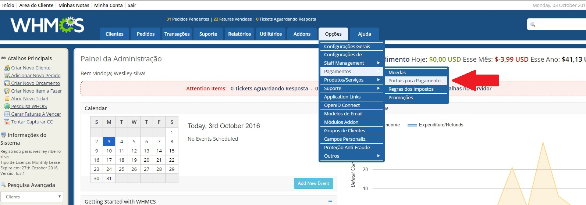
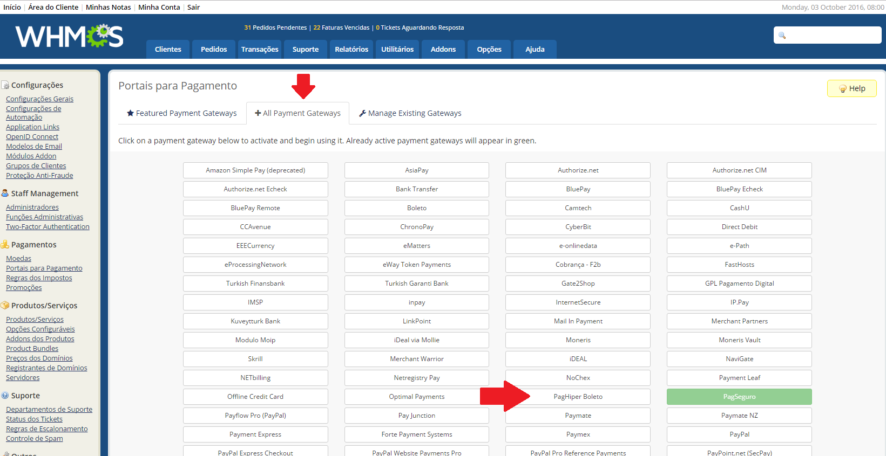
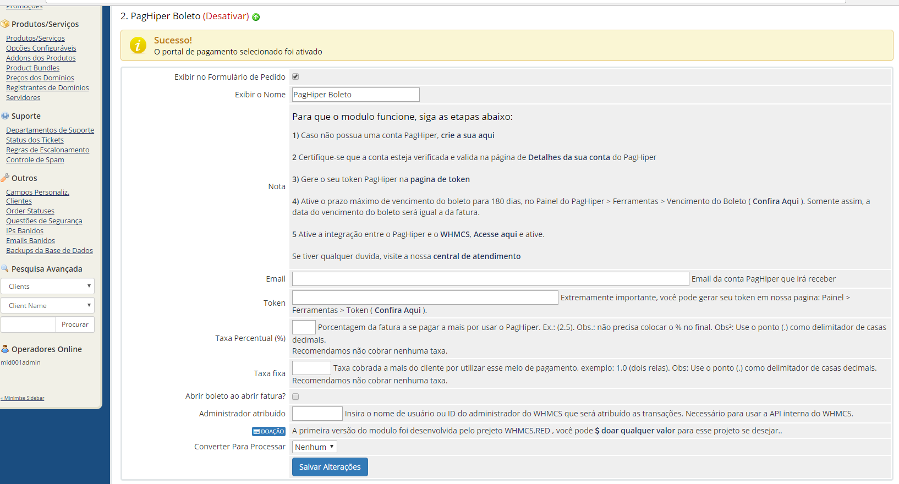

# whmcs - módulo de boleto PagHiper

Módulo de gateway de pagamento  para o WHMCS

Para que o modulo funcione, siga as etapas abaixo:

1) Caso não possua uma conta PagHiper,  [crie sua conta aqui](https://www.paghiper.com/abra-sua-conta/) 
 

2 Certifique-se que a conta esteja verificada e valida na página de [Detalhes da sua conta](https://www.paghiper.com/painel/detalhes-da-conta/) do PagHiper

3) Gere o seu token PagHiper na [pagina de token](https://www.paghiper.com/painel/token/)

4) Ative o prazo máximo de vencimento do boleto para 180 dias, no Painel do PagHiper > Ferramentas > Vencimento do Boleto . 
https://www.paghiper.com/painel/prazo-vencimento-boleto/
Somente assim, a data do vencimento do boleto será igual a da fatura.

5 Ative a integração entre o PagHiper e o WHMCS, [Acesse aqui e ative](https://www.paghiper.com/painel/whmcs).

Se tiver qualquer duvida, visite a nossa [central de atendimento](https://www.paghiper.com/atendimento/)

# Instalação:
Baixe o arquivo paghiper.php, coloque o arquivo na pasta gateways dentro de modules do seu WHMCS. 

Dentro da área administrativa do seu WHMCS, vá em: Setup > Payments > Payment Gateways (em inglês) ou Opções > Pagamentos > Portais para Pagamento

Após, va na aba “All Payment Gateways” e procure pelo modulo de nome: “PagHiper Boleto” e clique em cima.

Será exibida uma pagina semelhante a que se encontra na figura abaixo. Basta configurar com suas credenciais, e pronto.

